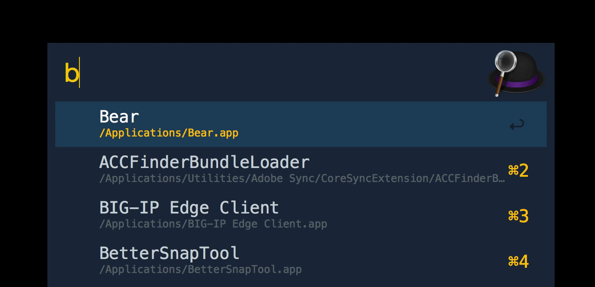

# arvis-bundlephobia

> Arvis workflow to find a JavaScript bundle size




## Install

```
$ npm install --global arvis-bundlephobia
```


## Usage

In arvis, type `bundlephobia`, <kbd>Enter</kbd>, and your query.


## License

MIT © [Prashant Palikhe](https://github.com/prashantpalikhe/arvis-bundlephobia)
